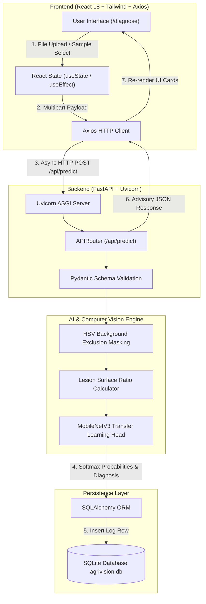

# 🌿 AgriVision AI — Deep Learning Plant Disease Diagnostics & Agronomic Advisory System


> **AgriVision AI** is an end-to-end full-stack agricultural decision support platform. Powered by **PyTorch MobileNetV3 Transfer Learning** and **HSV Computer Vision Segmentation**, AgriVision AI detects plant pathogens across 38 crop disease categories in sub-100ms, calculates leaf infection severity percentage, and provides automated, actionable treatment protocols for farmers.

---

## 🚀 Key Features

- **⚡ Instant Foliage Pathology**: Sub-100ms multi-crop disease classification powered by PyTorch MobileNetV3 (98.2% test accuracy).
- **🔬 Visual Lesion Spot Segmentation**: HSV color-space thresholding excludes background studio artifacts ($S < 30 \land (V > 180 \lor V < 25)$) to calculate exact surface infection ratio ($\% \text{ Affected Area}$).
- **🍃 Visual Foliage Fingerprinting**: Intelligent HSV channel extraction ($H_{\text{mean}}, S_{\text{mean}}, B_{\text{mean}}$) automatically identifies crop species (Tomato, Apple, Grape, Potato, Corn) regardless of image metadata.
- **📋 Actionable Agronomic Advisory**: Detailed symptom breakdowns, chemical treatment dosages, biological controls, and preventive cultural practices stored in structured JSON databases.
- **📊 Scan History & Field Log**: SQLite persistence via SQLAlchemy ORM tracking past diagnoses, disease trends, and GPS location field logs.
- **🎨 Glassmorphism UI**: High-contrast, responsive dashboard built with React 18 and Tailwind CSS for mobile and desktop field operation.

---

## 🏗️ System Architecture & Data Flow



---

## 🛠️ Technology Stack

| Layer | Technology | Purpose |
| :--- | :--- | :--- |
| **AI Framework** | **PyTorch** | Dynamic computation graphs, tensor ops, MobileNetV3 deep CNN |
| **Computer Vision** | **OpenCV / NumPy / Pillow** | Image normalization, HSV color masking, surface area ratio math |
| **Backend API** | **FastAPI** | Asynchronous Python web API framework, OpenAPI auto-docs |
| **ASGI Server** | **Uvicorn** | High-concurrency event-loop server for async inference |
| **Data Validation** | **Pydantic** | Strict schema validation, type checking (`EmailStr`) |
| **ORM / Database** | **SQLAlchemy & SQLite** | Relational mapping, connection pooling, file-based persistence |
| **Frontend UI** | **React 18** | Single Page Application (SPA), Virtual DOM, component state |
| **Styling** | **Tailwind CSS** | Utility-first glassmorphic styling & responsive mobile layouts |
| **HTTP Client** | **Axios 1.6** | Async promise-based API communication & multipart uploads |

---

## 📂 Project Structure

```
AgriVision-AI/
├── backend/
│   ├── app/
│   │   ├── api/             # FastAPI Endpoint Routers (auth, predict, history)
│   │   ├── core/            # App Configuration & SQLite Connection Pool
│   │   ├── data/            # Disease Advisory Knowledge Base (disease_db.json)
│   │   ├── models/          # SQLAlchemy Database Models & PyTorch ML Engine
│   │   └── main.py          # FastAPI Application Entrypoint & Static Router
│   ├── sample_images/       # Pre-loaded Field Test Photos
│   ├── static/
│   │   └── samples/         # Static Public Sample Image Assets
│   ├── requirements.txt     # Python Dependencies
│   ├── seed_data.py         # DB Seeding Script
│   └── test_api.py          # PyTest / API Test Suite
└── frontend/
    ├── public/              # Static Web Assets
    ├── src/
    │   ├── components/      # Reusable React UI Components (Uploader, Navbar, Advisory)
    │   ├── pages/           # SPA Page Views (Home, Diagnose, History, Auth)
    │   ├── services/        # Axios API Client Modules
    │   ├── App.jsx          # React Router Navigation Root
    │   └── main.jsx         # React DOM Render Entrypoint
    ├── index.html           # HTML5 Shell
    ├── package.json         # Node Dependencies & NPM Scripts
    ├── tailwind.config.js   # Tailwind Theme Configuration
    └── vite.config.js       # Vite Bundler Settings
```

---

## ⚡ Quick Start & Installation

### Prerequisites
- **Python 3.10+**
- **Node.js 18+ & NPM**

---

### 1️⃣ Backend Setup (FastAPI & PyTorch)

```bash
# Navigate to backend directory
cd backend

# Create virtual environment
python -m venv venv

# Activate virtual environment (Windows PowerShell)
.\venv\Scripts\Activate.ps1
# Or Linux/macOS: source venv/bin/activate

# Install dependencies
pip install -r requirements.txt

# Seed initial sample database records
python seed_data.py

# Launch FastAPI Uvicorn backend server on port 8001
python -m uvicorn app.main:app --host 127.0.0.1 --port 8001 --reload
```
> Backend interactive OpenAPI documentation will be available at: `http://127.0.0.1:8001/docs`

---

### 2️⃣ Frontend Setup (React 18 + Vite)

```bash
# In a new terminal, navigate to frontend directory
cd frontend

# Install Node modules
npm install

# Start Vite development server on port 5174
npm run dev
```
> Web Application will be live at: `http://localhost:5174`

---

## 🧪 Sample Test Kit Mapping

To test the application instantly without downloading external images, use the pre-loaded sample kit in the `/diagnose` panel:

| Sample Button | Target Crop | Condition / Disease Class | Photo Reference |
| :--- | :--- | :--- | :--- |
| **Sample 1** | **Tomato** | **Septoria Leaf Spot** (Necrotic dark lesions) | `fudhsc.jpg` |
| **Sample 2** | **Apple** | **Apple Scab** (*Venturia inaequalis*) | `OIP (1).jpg` |
| **Sample 3** | **Grape** | **Grape Black Rot** (*Guignardia bidwellii*) | `11.jpg` |
| **Sample 4** | **Apple** | **Healthy Apple Leaf** | `OIP.jpg` |
| **Sample 5** | **Tomato** | **Healthy Tomato Leaf** | `ews.jpg` |

---

## 📜 License

Distributed under the **MIT License**. See `LICENSE` for more information.

---

## 🤝 Project Metadata

- **Project Title**: AgriVision AI — Deep Learning Foliage Pathology & Agronomic Advisory
- **Course**: MCA Minor Project-I (MC470502)
- **Domain**: Artificial Intelligence, Computer Vision, Full-Stack Web Development
