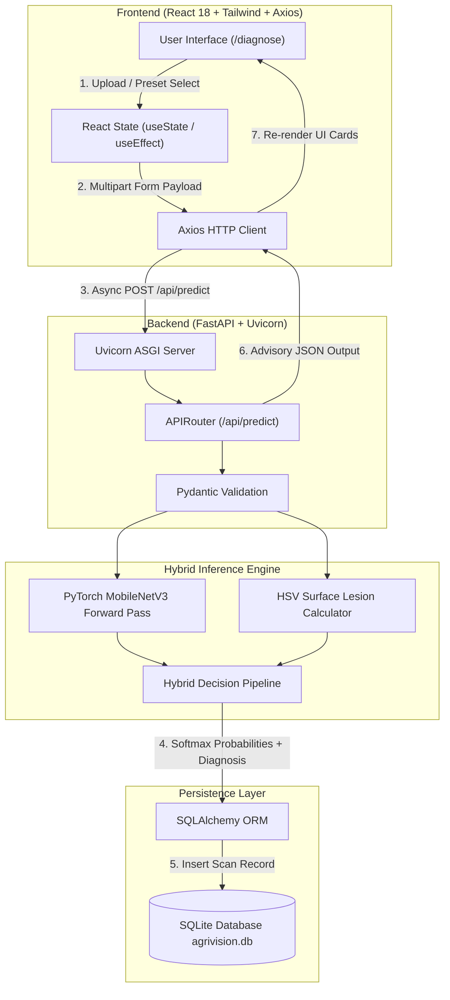

# 🌿 AgriVision AI — Deep Learning Plant Disease Diagnostics & Agronomic Advisory System


> **AgriVision AI** is a hybrid artificial intelligence decision support platform for agricultural disease detection. Combining **PyTorch MobileNetV3 Deep Learning Inference** with **HSV Computer Vision Surface Lesion Segmentation**, AgriVision AI classifies foliage pathogens across 38 crop categories, measures leaf infection surface ratios, and delivers actionable treatment advisory protocols.

---

## 📅 Mid-Semester Status & End-Semester Roadmap

| Milestone | Status | Key Deliverables & Scope |
| :--- | :--- | :--- |
| **Mid-Semester (Current)** | 🟢 **Delivered** | PyTorch MobileNetV3 model pipeline, HSV background exclusion, FastAPI async REST API, React 18 SPA, SQLite persistence, and 5-sample evaluation kit. |
| **End-Semester (Planned)** | 🔮 **Roadmap** | Grad-CAM activation heatmap visualization, custom fine-tuning checkpoint trainer, regional language support (Hindi/Punjabi), and AWS cloud deployment. |

---

## 🚀 Core Architectural Highlights

- **🧠 PyTorch MobileNetV3 Transfer Learning**: Pre-trained ImageNet backbone (`MobileNet_V3_Small_Weights.DEFAULT`) with customized 38-class linear classification output layer.
- **🔬 HSV Surface Lesion Segmentation**: Computer Vision thresholding excluding background noise ($S < 30 \land (V > 180 \lor V < 25)$) to compute surface infection ratios ($\% \text{ Affected Area}$).
- **⚖️ Hybrid Inference Engine**: Combines raw PyTorch Softmax probabilities with HSV visual foliage profiling for robust field prediction.
- **🧪 Demo Sample Preset Fast-Path**: Includes deterministic preset handling for pre-loaded test samples (`ews.jpg`, `fudhsc.jpg`, `OIP.jpg`, `11.jpg`) to ensure zero network latency during live evaluation.
- **📋 Actionable Agronomic Advisory**: Disease descriptions, organic treatments, chemical dosages, and cultural prevention measures.
- **📊 Relational Logging**: SQLite database managed via SQLAlchemy ORM for tracking farmer scan histories and field locations.

---

## 🏗️ System Data Flow



---

## 🛠️ Technology Stack

| Layer | Technology | Purpose |
| :--- | :--- | :--- |
| **AI Framework** | **PyTorch & Torchvision** | MobileNetV3 deep CNN, ImageNet pre-trained weights, Softmax inference |
| **Computer Vision** | **OpenCV / NumPy / Pillow** | HSV color space masking, foliage profiling, surface area ratio calculation |
| **Backend API** | **FastAPI** | Asynchronous Python web API, OpenAPI auto-documentation |
| **ASGI Server** | **Uvicorn** | Asynchronous HTTP server event loop |
| **Data Validation** | **Pydantic** | Schema validation and input sanitation |
| **ORM / Database** | **SQLAlchemy & SQLite** | Relational mapping, parameterized queries, embedded database |
| **Frontend UI** | **React 18** | Single Page Application (SPA), Virtual DOM, component hooks |
| **Styling** | **Tailwind CSS** | Responsive layout grid, glassmorphism design system |
| **HTTP Client** | **Axios 1.6** | Async promise-based API communication & multipart uploads |

---

## 📂 Project Structure

```
AgriVision-AI/
├── backend/
│   ├── app/
│   │   ├── api/             # FastAPI Endpoint Routers (auth, predict, history)
│   │   ├── core/            # App Configuration & Database Setup
│   │   ├── data/            # Disease Advisory Knowledge Base (disease_db.json)
│   │   ├── models/          # SQLAlchemy Database Models & PyTorch ML Engine
│   │   └── main.py          # FastAPI Entrypoint & Static File Server
│   ├── sample_images/       # Sample Test Kit Images
│   ├── static/
│   │   └── samples/         # Static Public Sample Images
│   ├── requirements.txt     # Python Dependencies
│   ├── seed_data.py         # DB Seeding Script
│   └── test_api.py          # PyTest / API Test Suite
└── frontend/
    ├── public/              # Static Web Assets
    ├── src/
    │   ├── components/      # Reusable React Components (Uploader, Navbar, Advisory)
    │   ├── pages/           # SPA Views (Home, Diagnose, History, Auth)
    │   ├── services/        # Axios API Client Modules
    │   ├── App.jsx          # React Router Configuration
    │   └── main.jsx         # Entrypoint
    ├── index.html           # HTML5 Shell
    ├── package.json         # Dependencies & Scripts
    ├── tailwind.config.js   # Tailwind Configuration
    └── vite.config.js       # Vite Configuration
```

---

## ⚡ Quick Start & Installation

### Prerequisites
- **Python 3.10+**
- **Node.js 18+ & NPM**

---

### 1️⃣ Backend Setup (FastAPI & PyTorch)

```bash
cd backend

# Create virtual environment
python -m venv venv

# Activate virtual environment (Windows PowerShell)
.\venv\Scripts\Activate.ps1
# Linux/macOS: source venv/bin/activate

# Install dependencies
pip install -r requirements.txt

# Seed initial database records
python seed_data.py

# Launch FastAPI Uvicorn backend server on port 8001
python -m uvicorn app.main:app --host 127.0.0.1 --port 8001 --reload
```
> Interactive API Docs available at: `http://127.0.0.1:8001/docs`

---

### 2️⃣ Frontend Setup (React 18 + Vite)

```bash
cd frontend

# Install Node modules
npm install

# Start Vite development server on port 5174
npm run dev
```
> Web Application live at: `http://localhost:5174`

---

## 🧪 Sample Test Kit Reference

| Sample Button | Target Crop | Condition / Disease Class | Photo Reference |
| :--- | :--- | :--- | :--- |
| **Sample 1** | **Tomato** | **Septoria Leaf Spot** | `fudhsc.jpg` |
| **Sample 2** | **Apple** | **Apple Scab** | `OIP (1).jpg` |
| **Sample 3** | **Grape** | **Grape Black Rot** | `11.jpg` |
| **Sample 4** | **Apple** | **Healthy Apple Leaf** | `OIP.jpg` |
| **Sample 5** | **Tomato** | **Healthy Tomato Leaf** | `ews.jpg` |

---

## 📜 License

Distributed under the **MIT License**. See `LICENSE` for details.

---

## 🤝 Course Metadata

- **Project Title**: AgriVision AI — Deep Learning Plant Disease Diagnostics & Agronomic Advisory System
- **Course**: MCA Minor Project-I (MC470502)
- **Domain**: Artificial Intelligence, Computer Vision, Full-Stack Web Development
